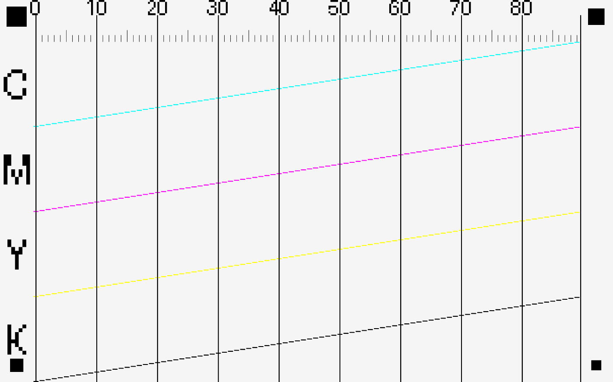
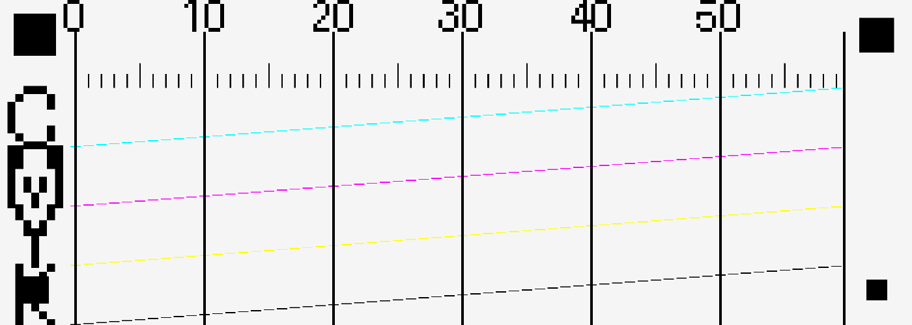
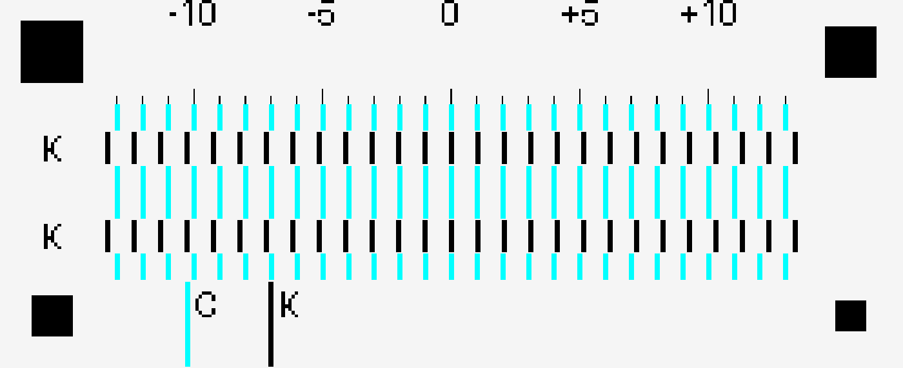

<p align="center">
  
</p>

# paintress-rip-encoder

Turns an ordinary image into a print job for a Paintress inkjet head. This is
the first half of the chain: the job it makes is what the daemon sends to the
board.

Part of [Paintress](https://paintress.dev), an open-source controller for
piezo inkjet printheads. The other published parts are
[paintress-protocol](https://github.com/paintress-team/paintress-protocol),
[paintress-daemon](https://github.com/paintress-team/paintress-daemon) and
[paintress-klipper-extras](https://github.com/paintress-team/paintress-klipper-extras).
The firmware is not published yet.

> **Status: experimental.** Paintress is not ready for general use yet, and
> things can change without notice.

```
  image (PNG/JPG/...)     .json + .bin          .json + .bin
        │                     │                     │
        ▼                     ▼                     ▼
   ┌─────────┐  RIP    ┌─────────────┐  encode ┌───────────────┐
   │ rip.py  ├────────►│ RIP payload │────────►│  printer job  │
   └─────────┘         │ (halftoned) │         │ (wire format) │
                       └─────────────┘         └───────────────┘
                              │
                       ┌──────┴───────┐
                       │  viewer.py   │  (optional: look at the payload)
                       └──────────────┘
```

Both files in the middle are a JSON header plus a binary file next to it. The
RIP payload holds the halftoned dots, the printer job holds the bytes the
firmware sends to the head.

| Tool         | Reads             | Writes                         | What it does |
|--------------|-------------------|--------------------------------|--------------|
| `rip.py`     | an image (PNG, ...) | RIP payload (`.json` + `.bin`) | turns the image into dots, split into passes |
| `encoder.py` | RIP payload       | printer job (`.json` + `.bin`) | packs the dots in the format the firmware expects |
| `viewer.py`  | RIP payload       | one image per ink              | lets you check a payload before printing |

## Installation

You need Python 3.8 or newer.

```sh
pip install -r requirements.txt
```

Two packages are optional but worth having:

- **numba** makes Floyd-Steinberg dithering much faster. Without it the RIP
  uses plain Python, which gives the same result but slowly.
- **scipy** is used to build the blue-noise texture. Without it, blue-noise
  dithering uses a rougher approximation.

## Basic ideas

These words come up everywhere in the code and the file formats.

### Channels

The list of channels comes from the head: `c6n90` has six
(`C, M, Y, K, LC, LM`), `c4n180` has four (`C, M, Y, K`). `LC` and `LM` are
light cyan and light magenta. The RIP only fills the four main colours. Light
channels that a head has are still carried, but empty, so the data always has
the same shape for that head.

This order is the order of the planes in the RIP payload, and it is part of the
head fingerprint that the daemon checks. Which output of the head fires each
channel is a separate setting per machine: the ink map (see
[`encoder.py`](#stage-2-encoderpy)).

### Head layouts

A head is described by a **layout** (`--head`, in `rip/head_layout.py`): its
nozzle pitch, its columns and its **slots**. A slot is one ink feed: a run of
nozzles at a known place. There are two layouts:

| Layout   | Pitch   | Slots | Channels |
|----------|---------|-------|----------|
| `c6n90`  | 90 npi  | 6 columns of 90 nozzles, all covering the same rows | C M Y K LC LM |
| `c4n180` | 180 npi | a left column of 180 nozzles (only its bottom 60 fire) and a right column split into three blocks of 60, stacked in Y | C M Y K |

Which ink goes into which slot is the **ink map** (`--ink-map`, or `ink_map`
in the calibration profile). You read it facing the head: left to right by
column, bottom to top inside a column. On `c6n90` all slots have the same
shape, so the ink map only changes which ink goes where. On `c4n180` the slots
sit at different heights, so the ink map also decides which rows each ink can
reach in a sweep.

### Nozzles, passes and bands

The nozzles in a slot are `nozzle_pitch_npi` per inch. To print at a higher
DPI, the head prints several **passes** that fill the gaps between nozzles,
each one shifted by one image row:

```
passes_per_band = dpi / nozzle_pitch_npi
lines_per_band  = band_step_nozzles * passes_per_band
```

`band_step_nozzles` is the **shortest slot that has ink**, not the length of
the column. Every ink has to cover the whole image, so the ink that covers the
least sets how far the head moves. On `c6n90` the shortest slot is the whole
column, so a band is one inch. On `c4n180` the smallest ink block is 60 of the
180 nozzles, so the head moves a third of an inch per band, even though its
columns are a full inch long.

A **band** is `lines_per_band` image rows in a row. It is printed by
`passes_per_band` passes. Inside a band, pass `p` prints rows
`p, p + passes_per_band, p + 2*passes_per_band, ...`: one row per nozzle.

On a head whose slots sit at different heights, the top slot can't reach the
bottom rows until the head has gone below them. So the print starts with a
**lead-in** below the image, and the first Y positions are negative
(16.93 mm on `c4n180`). See
[Lead-in](https://paintress.dev/concepts/swaths-and-passes/#lead-in-why-the-first-passes-sit-below-the-image)
on paintress.dev.

An example at 180 DPI with 90 nozzles (`passes_per_band = 2`):

```
band 0 = image rows 0..179
  pass 0 -> rows 0, 2, 4, ..., 178   (even rows)
  pass 1 -> rows 1, 3, 5, ..., 179   (odd rows)
```

The rest of Paintress (daemon, firmware, Klipper) calls a pass a **swath**.
It's the same thing.

### DPI

The DPI has to be a multiple of the head's nozzle pitch: 90 on `c6n90`, 180
on `c4n180`. `python rip.py --list-dpi [--head NAME]` lists the ones that
work for a head.

## How it works

### Stage 1: `rip.py`

`rip.py` goes through seven steps (see `process_image_for_printing`):

1. **Load the image and convert it to CMYK.** The image is read as floating
   point RGB, so 16-bit images keep their precision and dark areas don't band.
   Resizing is done in linear light (sRGB is decoded before resampling and
   encoded again after), so fine detail doesn't get darker. Then RGB becomes
   CMYK. With `--icc`, the conversion uses that CMYK profile through
   `PIL.ImageCms`. Without it, a UCR/GCR conversion moves neutral shadows to
   the K channel. The input is always treated as sRGB for now: an ICC profile
   embedded in the image is ignored.

2. **Dot gain.** Ink dots spread on the material, which makes the print
   darker. Each channel is lightened first with its own gamma curve. Yellow
   gets less of it than cyan and magenta, black gets more.

3. **Halftoning.** Each 8-bit channel becomes a 1-bit image (dot or no dot).
   There are three methods:
   - `floyd_steinberg` (the default) spreads the error to the neighbours and
     keeps detail sharp. It goes back and forth on alternate rows, which
     avoids the "worm" patterns of always going left to right.
   - `blue_noise` compares each pixel to a blue-noise texture. It looks
     smooth. Each channel uses a different texture, so the inks don't land dot
     on dot, which would make the print grainier and shift the colour.
   - `ordered` compares against a Bayer matrix. It's the fastest, and you can
     see the pattern.

4. **Passes.** The 1-bit images are cut into passes as described above. Each
   pass is an array of shape `(channels, nozzles, image_width)`. The cutting
   starts at the bottom: pass 0, the lowest Y, holds the bottom of the image.
   That way the print comes out the right way up on a machine whose origin is
   the bottom-left corner and whose passes move in +Y. Three optional features
   also act here:
   - `--nozzle-comp` hides dead nozzles (see
     [Dead nozzles](#dead-nozzles---nozzle-comp)).
   - `--band-overlap N` overlaps bands by N rows and splits the seam at random.
     A small error in the Y move then shows up as noise instead of a hard line
     repeated at every band.
   - `--shingle N` is for media that doesn't absorb ink: each pass is printed
     in N sweeps that alternate columns, so wet drops have time to settle.

5. **Light channels.** Channels the head has but the colour path doesn't fill
   (LC/LM on `c6n90`) are added as empty planes, so every pass carries all of
   the head's channels. On `c4n180` there is nothing to add.

6. **Y positions.** The Y position of every pass, in mm, comes from its first
   row and the row spacing (`25.4 / dpi`). The move between two passes is
   stored too.

7. **Saving.** Everything goes into a RIP payload: a JSON header (settings,
   Y positions, array shape and CRC) and a binary file with the dots packed
   eight to a byte (`np.packbits`, see `rip_payload.py`).

`--width` and `--height` (in mm) resize the image to that size at the chosen
DPI (Lanczos, before halftoning). If you give only one, the other keeps the
proportions. With neither, the image is printed at its own size. The print
size stored in the job always comes from the final image.

### Stage 2: `encoder.py`

`encoder.py` turns the RIP payload into the exact bytes the firmware expects
(see `convert_rip_to_printer_format`):

1. **Ink map.** The head's outputs are its slots, numbered left to right as
   you face it: six on `c6n90` (three colour groups of two columns), four on
   `c4n180`. Which ink is in which slot depends on how the machine is set up,
   not on the image, so the encoder sends each channel to a slot using the
   **ink map** (`--ink-map`). The default is the head profile's standard
   setup (`slot_inks` in
   [paintress-protocol](https://github.com/paintress-team/paintress-protocol):
   `K, Y, LM, LC, C, M` on `c6n90`, `K, C, M, Y` on `c4n180`). `-` marks an
   empty slot, which fires nothing, and each ink can appear only once. A
   channel that has ink but no slot stops the encoder with an error, so ink
   never disappears without a word.

2. **Slot offsets.** On a real head the slots are some distance apart, so
   they don't pass over the same spot at the same time. The encoder shifts
   each slot's data along the print direction by that distance, so all inks
   land on the same spot as the head moves. Two distances set this:
   - `column_gap_mm` (default 0.842 mm), between the two columns of a colour
     group;
   - `group_gap_mm` (default 7.051 mm), between colour groups.

   The defaults are the `c6n90` distances measured with the `col_align`
   target: 3 and 25 nozzle pitches (1/90"), set 5 µm below the exact values
   because the offsets are rounded up to whole pixels.

   The head moves left to right, so the rightmost slot (5) goes first and
   needs no delay, while slot 0 comes last and gets the biggest offset. With
   the default ink map, M goes first and K last. The offsets make the image
   wider; the new width is stored in the job.

3. **Columns.** Each printed column (one firing of the nozzles) is turned
   into what the head's shift register expects. The unit is a **bus**: one
   data pin's share of the head, 180 nozzle positions plus a 32-bit tail,
   392 bits (49 bytes) in all, sent two bits per clock (see
   `encoder/head_packer.py`):
   - Each nozzle position has a **2-bit code**, but its two bits aren't next
     to each other. A bus is two blocks of 180, so position `p` has the first
     bit of its code at index `p` and its fire bit at `180 + p`. For now only
     `00` (don't fire) and `01` (fire) are used, so the first block is always
     zero. The head also accepts the other codes, for different drop sizes.
   - The last 32 bits are the **window-enable map**: which drop codes fire in
     which time window after the latch. It's an electrical property of the
     head and comes from the head profile (`--window-map` overrides it on the
     bench).
   - **What goes on the bus is the only part that depends on the head.** It
     comes down to one table per bus saying which nozzle feeds each of the 180
     positions. On `c6n90` a bus mixes *two* columns of 90 nozzles, which is
     why a bus is a "group" there (`A` = slots 0+1, `B` = slots 2+3,
     `C` = slots 4+5). On `c4n180` a bus serves one column of 180, so the
     table is a straight run. The tables differ; the packing code is the same.

4. **Packing.** The 49-byte buses are packed into one **147-byte line**: 196
   clocks × 6 bits (three data pins × two clock edges) = 1176 bits, with no
   padding. A head that uses fewer buses than the line has (`c4n180` uses two
   of the three pins) leaves the spare one at zero. That's why both heads use
   the same 147-byte line and one firmware serves both.

5. **Saving.** The packed lines go into a `.bin` file, next to a JSON header
   (`.json`) with the settings and an index of the passes. The format is
   defined by the `paintress_job` module, copied from
   [paintress-protocol](https://github.com/paintress-team/paintress-protocol).

### `viewer.py`

`viewer.py` is a checking tool. It loads a RIP payload, undoes the pass
cutting to rebuild each ink as a full-resolution image, and writes one image
per ink. It can also merge them into a CMYK image (TIFF) and an RGB preview
(PNG). It isn't needed to print.

## Usage

The tools expect images in `rip/input/` and write to `rip/output/`,
`encoder/output/` and `rip/output_channels/`. These folders aren't in the
repository; create them when you need them.

### `rip.py`

```sh
python rip/rip.py INPUT_IMAGE -o OUTPUT.json [options]
```

| Option              | Default           | What it does |
|---------------------|-------------------|--------------|
| `input`             | required          | The image (PNG, JPG, ...). |
| `-o`, `--output`    | required          | The `.json` to write; the `.bin` is written next to it. |
| `--head`            | `c6n90`           | The head: `c6n90` or `c4n180`. The calibration targets follow it: the nozzle check shows the nozzles each slot fires, and `col_align` measures one distance per column (a single K-to-C distance on `c4n180`). |
| `--ink-map`         | the head's standard | Which ink is in each slot, separated by commas, in the order you read the head (`-` = empty). Overrides the profile. |
| `--dpi`             | the head's default | Print resolution. Must be a multiple of the head's nozzle pitch (630 on `c6n90`, 720 on `c4n180`). |
| `--width`           | the image's own   | Print width in mm. The image is **resized** to this at the DPI. |
| `--height`          | the image's own   | Print height in mm. The image is **resized** too (see `--width`). |
| `--dither`          | `floyd_steinberg` | `floyd_steinberg`, `blue_noise` or `ordered`. |
| `--blue-noise-size` | `64`              | Size of the blue-noise texture: 32, 64, 128 or 256. |
| `--icc`             | none              | A CMYK ICC profile. |
| `--calibration`     | the default profile | A calibration profile JSON (see below). It decides everything about colour. |
| `--list-dpi`        |                   | List the DPI values that work, and exit. |

If you give only `--width` or only `--height`, the other keeps the
proportions. Giving both can stretch the image, and you get a warning.

#### Calibration profile

Everything about colour is in a **calibration profile** JSON: dot gain, the
amount of each ink, the total ink limit, less ink at high DPI, and how much
black replaces CMY. The profile decides; the one that comes with the
repository is `rip/profiles/default.json`, used when `--calibration` isn't
given. That file shows every field, and
[`docs/RIP_USAGE_GUIDE.md`](docs/RIP_USAGE_GUIDE.md) explains them one by
one.

A profile can also name the **head** it was measured on (`"head": "c6n90"`).
If it does and it doesn't match `--head`, the RIP stops with an error:
`dead_nozzles` are stored per slot and `ink_map` describes one head's
plumbing, so neither carries over to another head.

`dpi_curves` holds the **measured tone curves** (256-value lookup tables) for
each channel, one set per DPI. `tools/calibrate_from_scan.py` fills them; the
default profile has none. When a full C/M/Y/K set exists for the print's
DPI, the RIP uses it **instead of** the dot gain and the DPI ink reduction,
because the measured curve already includes both. The total ink limit still
applies after it. `calibrate_from_scan.py --gray-balance` also measures gray
balance: it makes the C, M and Y curves end at the same darkness (that of the
weakest ink), so equal amounts give an equal tone and grays print gray. It
costs a little saturation.

With no measured curve for the DPI, the RIP uses a **modelled** curve
(Murray-Davies) if the profile has `drop_diameter_um`, an estimate of the drop
size on that media. It works much better than a fixed gamma at a DPI you
haven't measured. Without it, the RIP falls back to dot gain plus ink limits.
The job records which path was used in `metadata.processing.colour_mode`
(`linearised` or `heuristic`) and `lut_source` (`measured` or `modelled`).

These flags change one field of the loaded profile, for this run only:

| Flag                    | Changes |
|-------------------------|---------|
| `--dot-gain V`          | Dot gain, as `C=M=V, Y=0.75V, K=1.25V`. |
| `--no-dot-gain`         | Turns dot gain off. |
| `--ink-scale`           | Multiplies all ink. |
| `--cyan/magenta/yellow/black-scale` | Multiplies one ink. |
| `--max-total-ink`       | The most CMYK ink allowed on one pixel (a fraction). |
| `--black-generation`    | How much black replaces CMY (0 to 1), without `--icc`. |
| `--black-start`         | Where black starts replacing CMY (0 to 1): below it grays stay CMY, above it they go to K. |
| `--shingle N`           | For media that doesn't absorb ink: print each pass in N sweeps that alternate columns (1 = off, 2 = even/odd). Takes N times as many sweeps. |
| `--band-overlap N`      | Overlap bands by N rows and split the seam at random. 0 = off. |
| `--reference-dpi`       | The DPI where ink reduction starts. |
| `--no-dpi-compensation` | Don't reduce ink above the reference DPI. |
| `--no-ink-limit`        | No ink limit and no per-channel scaling at all. |

```sh
# Basic run at 630 DPI (uses rip/profiles/default.json)
python rip/rip.py rip/input/image.png -o rip/output/job.json

# With a profile for a given media
python rip/rip.py rip/input/image.png -o rip/output/job.json \
    --calibration rip/profiles/glossy.json

# Blue-noise dithering at 720 DPI with an ICC profile
python rip/rip.py rip/input/image.png -o rip/output/job.json \
    --dpi 720 --dither blue_noise --icc profile.icc

# Change only the magenta amount on top of the profile
python rip/rip.py rip/input/image.png -o rip/output/job.json --magenta-scale 0.9

# Resize to a 50 mm wide print (the height keeps the proportions)
python rip/rip.py rip/input/image.png -o rip/output/job.json --width 50
```

#### Calibration targets (`--target`)

`rip.py` can also make **calibration targets**, with no input image:

- `wedge`, a step wedge used to measure the tone curves;
- `nozzle_check`, which fires every nozzle once;
- `col_align`, which measures the distance between the colour columns.

All three skip the colour steps, are halftoned like a normal print, and have a
solid black square in each corner. Only the wedge is scanned: it is the one
automatic calibration, and `calibrate_from_scan.py` finds the scan's position
from those squares. `nozzle_check` and `col_align` are read by eye. The print
isn't mirrored on the bed, so the target's layout in `metadata.target` is the
same as the image. **Scan the wedge more or less upright**: a small tilt is
fine, but don't turn it 90° or 180°, and don't flip it.

**`--target wedge`** prints five rows of patches (C, M, Y, K and a gray made
of equal C, M and Y) going from 0 to 100 % ink.

The `--steps` levels are split into panels side by side, so the target comes
out roughly square and fits in a `--max-x-mm` × `--max-y-mm` box (200 × 200 mm
by default). The patches are made as big as the box allows, because big
patches scan better. The wedge skips dot gain, ink limits and DPI reduction on
purpose: it measures the raw response of the head that the tone curves are
meant to correct.

A job has only one DPI, so **make one wedge per DPI** you want to calibrate.

| Option        | Default | What it does |
|---------------|---------|--------------|
| `--target`    | none    | `wedge` makes a target instead of processing an image. |
| `--steps`     | `33`    | Number of levels per channel. |
| `--max-x-mm`  | `200`   | Largest width in mm (the direction the head sweeps). |
| `--max-y-mm`  | `200`   | Largest height in mm (the direction the paper advances). |
| `--gap-mm`    | `2.0`   | Space between patches in mm. |
| `--preview`   | none    | Also write a labelled RGB preview PNG here. |

```sh
# A 630 DPI wedge in a 200x200 mm box (about 200 x 151 mm, ~10 mm patches),
# plus a preview to look at before printing
python rip/rip.py --target wedge -o rip/output/wedge_630.json --dpi 630 \
    --preview rip/output/wedge_630_preview.png

# For a smaller bed
python rip/rip.py --target wedge -o rip/output/wedge_630.json --dpi 630 \
    --max-x-mm 150 --max-y-mm 150
```

**`--target nozzle_check`** fires **every nozzle once**, for every ink the head
has. For each ink, every nozzle its slot fires prints one short dash, and the
dashes step along in a diagonal comb so each one stands alone. A missing dash
is a dead nozzle; a faint one is a weak nozzle. Each dash is printed by
exactly one nozzle. Only the nozzles a print really fires are checked: the
unused nozzles of a slot can't affect a print. Each ink has its own comb, so
inks that are hard to tell apart by eye (LC/LM next to C/M on `c6n90`) are told
apart by where their comb is.

The target is made to be **read by eye**. It has a ruler across the top (a
mark per nozzle and a number every 10), lines down the page every 10 nozzles,
and the ink's name next to each comb. To read it: find the gap, follow the line
up to the ruler, read the number. The dashes are tiny (about 0.3 mm tall), and
a person reading a numbered chart is more reliable than a program looking for
them in a scan.

<p align="center">
  <br>
  <br>
  <em>The <code>--preview</code> of <code>nozzle_check</code> on <code>c6n90</code> (top) and <code>c4n180</code>.
  A missing dash under the ruler gives the number of the dead nozzle.</em>
</p>

| Option        | Default | What it does |
|---------------|---------|--------------|
| `--dash-mm`   | `1.5`   | Length of each dash in mm (along the sweep). |
| `--dx-mm`     | `1.8`   | X step between two nozzles' dashes, in mm. |
| `--preview`   | none    | Also write an RGB preview PNG. |

```sh
python rip/rip.py --target nozzle_check -o rip/output/nozzle_630.json --dpi 630 \
    --preview rip/output/nozzle_630_preview.png
```

Then print it, read the dead nozzles, and record them:

```sh
python tools/record_dead_nozzles.py --profile rip/profiles/mymedia.json \
    --dead "Y:10,11,50;K:30"
```

**`--target col_align`** measures the **real distance between the colour
columns**: the `--column-gap` and `--group-gap` values the *encoder* uses to
line the inks up in X. Print it the normal way (encode it with the gaps you
want to check). Each tested ink (C, Y, K) then prints a row of cells. In each
cell a short mark of that ink sits between two magenta marks, and each cell
shifts the ink by a different number of pixels `k`, shown on a ruler. The cell
that looks straightest gives the error, to within one pixel, and
`tools/col_align_gaps.py` turns those readings into corrected gaps. A band at
the bottom (one full-height line per column) shows whether the head is tilted
and whether its columns are straight. The marks of a cell all come from the
same band, with the ink mark centred between the two magenta ones, so trigger
jitter and a small head tilt don't affect the reading.

<p align="center">
  <br>
  <em>The <code>--preview</code> of <code>col_align</code> on <code>c4n180</code>. The ruler gives the shift of each cell.</em>
</p>

| Option            | Default | What it does |
|-------------------|---------|--------------|
| `--span-mm`       | `0.8`   | How far the cells shift, ± this many mm (in whole pixels). |
| `--cell-pitch-mm` | `2.5`   | X distance between cells in mm. |
| `--mark-mm`       | `0.5`   | Width of a mark in mm. |
| `--repeats`       | `2`     | How many times the row of cells is repeated. |
| `--preview`       | none    | Also write an RGB preview PNG. |

```sh
python rip/rip.py --target col_align -o rip/output/colal_630.json --dpi 630 \
    --preview rip/output/colal_630_preview.png
# encode, print, read the straightest k for each ink off the ruler, then:
python tools/col_align_gaps.py "C:-2;Y:3;K:5" --payload rip/output/colal_630.json
#   -> prints the corrected --column-gap / --group-gap for encoder.py
```

### `encoder.py`

```sh
python encoder/encoder.py INPUT.json -o OUTPUT.json [options]
```

| Option           | Default | What it does |
|------------------|---------|--------------|
| `input`          | required | The RIP payload `.json` made by `rip.py`. |
| `-o`, `--output` | required | The job `.json` to write; the `.bin` goes next to it. |
| `--column-gap`   | `0.842` | Distance between the columns of a colour group, in mm (measured on `c6n90`). |
| `--group-gap`    | `7.051` | Distance between colour groups, in mm (measured on `c6n90`). |
| `--ink-map`      | the payload's, else the profile's | The ink in each head output, left to right as you face the head; `-` = empty slot. Overrides the ink map stored in the RIP payload, which itself falls back to the head profile's standard setup. |
| `--window-map`   | the head profile's | **For the bench.** Replaces the 32-bit window-enable map for this job. Only useful while a head's real map is unknown; see `tools/window_map_probe.py`. |
| `--bus-order`    | the head profile's | **For the bench.** How a bus's 180 positions map to nozzles: `straight` (position *p* is nozzle *p*) or `interleaved` (two sets of 90, the way `c6n90` puts two columns on one bus). Both heads set their own, so you shouldn't need it. |

```sh
python encoder/encoder.py rip/output/job.json -o encoder/output/job.json
# four inks, light channels not connected:
python encoder/encoder.py rip/output/job.json -o encoder/output/job.json --ink-map "K,Y,-,-,C,M"
```

`--column-gap` and `--group-gap` have to match the real head, and the ink map
has to match how the inks are really connected (the rightmost slot goes
first). The ink map is part of the machine setup, so it's stored once, in the
calibration profile (`ink_map`). The RIP writes it into every payload and the
encoder uses it from there, so you only need `--ink-map` to override it. With
a single source, the encoder, the RIP's dead-nozzle compensation and
`record_dead_nozzles.py` all agree on which ink is where.

### `viewer.py`

```sh
python rip/viewer.py INPUT.json -o OUTPUT_DIR [options]
```

| Option               | Default              | What it does |
|----------------------|----------------------|--------------|
| `input`              | required             | The RIP payload `.json` made by `rip.py`. |
| `-o`, `--output-dir` | `./output_channels`  | Folder for the images. |
| `--format`           | `png`                | Image format: `png`, `tiff` or `bmp`. |
| `--no-invert`        | off                  | Keep white dots on black instead of the other way round. |
| `--no-combined`      | off                  | Don't write the combined CMYK and RGB images. |
| `--soft-proof PATH`  | none                 | A simulated print: dots spread to the drop size and blended, so you can see tone, grain, dead nozzles and band seams. |
| `--drop-diameter-um` | the payload's, or 40 | Drop size for the simulated print and the ink estimate. |
| `--drop-volume-pl`   | estimated from the size | Measured drop volume for the ink estimate. |

`viewer.py` also prints an **ink estimate** (dots fired × drop volume, per ink
and in total), handy before a long print.

```sh
python rip/viewer.py rip/output/job.json -o rip/output_channels/
```

### `tools/calibrate_from_scan.py`

The second half of the tone calibration: it reads a scan of a printed wedge,
builds a tone curve for each channel, and stores them in the calibration
profile.

```sh
python tools/calibrate_from_scan.py SCAN.png --payload WEDGE.json \
    --profile PROFILE.json [-o OUT.json] [--preview overlay.png]
```

| Option           | Default     | What it does |
|------------------|-------------|--------------|
| `scan`           | required    | The scan of the printed wedge (PNG or TIFF). |
| `--payload`      | required    | The RIP payload the wedge came from (it holds the layout). |
| `--profile`      | required    | The calibration profile JSON to update. |
| `--out`          | `--profile` | Where to write the updated profile. |
| `--inset`        | `0.3`       | How much of each patch's edge to leave out before averaging. |
| `--gray-balance` | off         | Also balance gray: make C, M and Y end at the same darkness so grays print gray. |
| `--preview`      | none        | Write a check image (the corner squares and the sampled areas). |

It finds the four corner squares and works out where the target is on the
scan (it copes with a slightly turned or scaled print). Then it measures each
patch in the colour its ink absorbs (C in red, M in green, Y in blue, K and
gray in brightness), compares it to the white of the paper, and turns the
ink-to-tone curve (in L\*, which follows how we see) into a 256-value table
per channel, written to `dpi_curves[<dpi>]`.

Scan with **automatic exposure, automatic colour, sharpening and descreen
turned off**, and with the same settings every time. For these curves, the
scans being consistent matters more than exact colour. About 300 spi is
plenty: the scanner should blend the dots, and higher only shows single dots
and adds noise.

Calibrate **one DPI per scan** (one printed wedge per DPI). Use `--preview` to
check that the green sampling boxes are inside the patches before you trust
the result. The tool also prints how far the gray row is from a straight line
(an RMSE). It's high on a raw wedge and drops once the curves are applied and
the wedge is printed again, so it's one number to follow from one try to the
next.

### `tools/record_dead_nozzles.py`

Stores `dead_nozzles` in the calibration profile, for every ink the head has.
Read the printed nozzle check by eye and give the dead nozzles per ink:

```sh
python tools/record_dead_nozzles.py --profile PROFILE.json --dead "Y:10,11,50;K:30;LC:7"
```

| Option      | Default     | What it does |
|-------------|-------------|--------------|
| `--dead`    | required    | Dead nozzles per ink, for example `"C:3,17;M:42"`. An empty string clears the list. |
| `--profile` | required    | The calibration profile JSON to update. |
| `--out`     | `--profile` | Where to write the updated profile. |

A dead nozzle belongs to a **slot** (a nozzle column), not to an ink. So you
give the nozzles per ink, but they are **stored per slot**, using the
profile's `ink_map`. If you later connect the inks differently, the list is
still right, and the RIP works out which channel each dead nozzle belongs to
when it compensates. An ink the map doesn't connect has no slot, so its
entries are dropped.

Purge before you read the check: only the nozzles that don't come back need
compensating.

#### Dead nozzles (`--nozzle-comp`)

Once `dead_nozzles` is in the profile, `rip.py --nozzle-comp` hides the dead
nozzles in a real print. Each nozzle prints a row, so a dead nozzle is a
missing line. Pick one per run:

| `--nozzle-comp` | Cost | What it does |
|-----------------|------|--------------|
| `none`    | none         | No compensation (the default). |
| `reroute` | free         | During Floyd-Steinberg, a dead nozzle's rows never get a dot, and their ink goes to the rows next to them. It only helps partly: a fully dead nozzle covers `passes_per_band` rows, which is wider than a drop, so a faint gap can stay. In a large group of dead nozzles, the ink of rows with no working neighbour within one nozzle pitch is dropped, so it smears locally instead of piling up far away. Needs `--dither floyd_steinberg`. |
| `retouch` | about 2× the sweeps | Adds passes that print only the dead rows, shifted by one nozzle pitch so the **nearest working nozzle** prints them (`n-1` first, else `n+1`). Complete for single dead nozzles and for both edges of a group; only the *middle* of a group (both neighbours dead) stays empty. |

```sh
python rip/rip.py photo.png -o job.json --dpi 630 \
    --calibration rip/profiles/mymedia.json --nozzle-comp retouch
```

Purge first. Compensation is for the few nozzles a purge can't bring back, not
a replacement for a healthy head. The mode used is stored in
`metadata.processing.nozzle_comp`.

### `tools/col_align_gaps.py`

Turns what you read on a printed `col_align` target into the encoder's
`--column-gap` and `--group-gap`. For each tested ink, find the straightest
cell and read its `k` on the ruler:

```sh
python tools/col_align_gaps.py "C:-2;Y:3;K:5" --payload COLAL.json \
    [--column-gap MM] [--group-gap MM] [--json OUT.json]
```

| Option         | Default  | What it does |
|----------------|----------|--------------|
| `readings`     | required | The straightest `k` per ink, for example `"C:-2;Y:3;K:5"`. |
| `--payload`    | required | The col_align payload that was printed. |
| `--column-gap` | `0.842`  | The `column_gap_mm` the target was **encoded** with (same default as the encoder). |
| `--group-gap`  | `7.051`  | The `group_gap_mm` the target was **encoded** with (same default as the encoder). |
| `--json`       | none     | Also write the full report as JSON. |

If the straightest cell is at `k`, that shift cancelled the error, so the
error is `-k` pixels. The tool works out the exact pixel offsets the encoder
used (each gap is rounded up to whole pixels on its own, which is why it needs
the gaps you encoded with), turns the errors into **real distances behind
magenta**, finds the two gaps that fit best, and prints the encoder flags to
use. If an ink is off the fit by more than half a pixel, the head's columns
aren't evenly spaced and two numbers can't describe it. The band at the bottom
of the target shows the head's tilt and the straightness of its columns.

### Calibration order

Clogged nozzles **spoil the colour calibration**. The wedge is printed
without any correction, and each patch's tone is the average of the nozzles
that print it, so a dead nozzle leaves a light streak through every patch and
bends the measured curve, mostly in the light tones. Do it in this order:

1. **Nozzle check, purge, check again** until almost no nozzle is clogged. The
   nozzle check doesn't depend on the colour calibration, so you can trust it.
   Don't go on until it's clean.
2. **Calibrate with the wedge** on the healthy head, into a profile for that
   media (`--out rip/profiles/mymedia.json`), so the default profile
   (`rip/profiles/default.json`) stays generic and its `dpi_curves` stays
   empty.

Two things protect step 2 from a few clogs that remain:

* `calibrate_from_scan.py` measures each patch as the **median of its row
  averages**, so a few light rows from dead or weak nozzles are ignored and a
  clean patch isn't affected.
* It **refuses to save a curve that looks broken** (almost all-or-nothing: the
  light tones missing, or the whole range squeezed into a small band of ink)
  and tells you to purge and print again. `--force` saves it anyway, only for
  looking at it.

## Bench tools

These aren't used to print. They're for finding out, on a real head, the two
things that can only be confirmed by firing ink: the **32-bit window-enable
map** and which nozzle each bus position feeds. You need them when you bring
up a new head, not in normal use.

The tools that talk to the board (`window_map_probe.py`,
`purge_sweep_runner.py`) use the daemon's serial code, so they need a checkout
of [paintress-daemon](https://github.com/paintress-team/paintress-daemon) next
to this repository (`../paintress-daemon`), and `pyserial`.

### `tools/window_map_probe.py`

Tries possible window-enable maps on a real head over USB. Every printed column
carries its own copy of the 32 bits, so one pass can carry every candidate: N
columns per candidate with blank space between them, and you read the answer
off the print.

It talks to the **board directly**, not through the daemon: it uses the
daemon's `SerialManager` and `SwathHandler` and speaks the protocol itself,
because a bench probe doesn't want a job file, a TCP connection or a head
check. `PURGE` can't be used for this: it fires `channel_masks[]`, a table
built into the firmware, so it would test the firmware's window bits and not
the encoder's.

> **Wire the trigger.** `ARM` doesn't fire. It waits for a rising edge on
> `TRIGGER_IN_PIN` and gives up after about 10 s with a `TRIGGER_TIMEOUT`
> event. On the bench, drive that pin from a spare output or touch it to 3V3.
> The tool tells you when it's waiting.

```sh
python tools/window_map_probe.py --port COM5 --head c4n180 --mode sweep
```

### `tools/gen_channel_masks.py`

Writes the firmware's `channel_masks[]` table, for purging, and for finding
the window map *without* the trigger or a 225 KB upload. `PURGE` fires without
an outside trigger and without sending a pass, so the search becomes: build
one purge channel per candidate, flash once, fire them all.

`--mode` picks the table:

- `windows` (the default) checks the 8-windows × 4-codes model against a map
  read from a capture, in seven rows, without changing the header.
- `sweep` has one row per window bit: 32 plus two controls, so 34 purges from
  one flash, with nothing to decode and no guess about how many bits matter.
  Use it on any head you don't already know.
- `probe` is a cheaper test with five probes. It is **wrong on a head whose
  bits pick groups of nozzles instead of turning firing on or off for all**,
  which is exactly what `c4n180` turned out to do. Write down which *colours*
  each channel fires, not just whether it fired.
- `purge` writes the real per-ink purge table.
- `drop`, `confirm`, `blocks`, `diagnose`, `buswire` and `codes` are smaller
  bench tests.

The generator checks itself on every run (`--self-test`):
`--mode purge --head c6n90` must rebuild the table now in the firmware's
`engine/channels.c`, all seven rows, byte for byte.

It also writes a **manifest** of the flash: which channel is which and what
each one should do.

`-o` writes the table to a file (usually `engine/channels.c` in the firmware)
instead of the screen. A sweep **also needs** `--header`, because 34 rows need
a bigger `CH_COUNT`; without it, every channel after the seventh is refused.
`--manifest` defaults to `tools/sweep_manifest.json`, which is what
`purge_sweep_runner.py` reads.

```sh
python tools/gen_channel_masks.py --head c4n180 --mode sweep \
    -o <firmware>/engine/channels.c --header <firmware>/engine/channels.h
```

### `tools/purge_sweep_runner.py`

Fires that sweep over USB and keeps the score, because reading the answer
means firing a lot of channels while you look at the head, not the screen.
**Firing never asks for confirmation**: Enter fires the next channel and
comes straight back, and one character records a result for the channel fired
last. The results are saved to JSON after every entry, so you can stop and
carry on later. It reads the generator's manifest, so it can tell you when a
result doesn't match what was expected.

```
sweep> <enter>     fires the next channel
sweep> -           nothing came out (of the one just fired)
sweep> + CMY       ink came out, these colours
sweep> 4           fires channel 4
sweep> 4 +         records channel 4 without firing it
```

```sh
python tools/purge_sweep_runner.py --port COM5 \
    --manifest tools/sweep_manifest.json --results sweep_results.json
```

### `tools/decode_capture.py`

Decodes a logic analyser capture of one printed column back into head data.
This is how the encoder's model of the bus can be proven wrong. Everything the
encoder does to a bus was worked out by probing the original controller of a
printer we own with an oscilloscope and a logic analyser, and it was only
confirmed indirectly, by whether ink came out. A clean capture of that
controller driving the same head can show that the model is wrong.

It expects a Saleae-style CSV of *changes* (one row per change), with the data
buses on the first channels and the shift clock last, sampled on both clock
edges. For each bus it shows the two code blocks and the window map, how often
each of the four 2-bit codes appears, and which nozzle blocks are active. On a
392-edge capture it also shows whether the block edges fall where the encoder
puts them.

Run it again on any new capture before you use that capture as proof of
anything.

```sh
python tools/decode_capture.py capture.csv --clock 2 --names "bus0,bus1"
```

## File formats

### RIP payload: `.json` + `.bin`

Written by `rip.py`, read by `encoder.py` and `viewer.py` (see
`rip_payload.py`). The header holds the settings and the Y position of each
pass. The `.bin` holds the dots of every pass, an array of shape
`(passes, channels, nozzles, width)` with 0/1 values, packed eight to a byte
with `np.packbits`. A CRC-32 protects it. The example below is `c6n90`, so the
shape is `(passes, 6, 90, width)`.

```jsonc
// job.json  (next to it: job.bin)
{
  "format": "paintress-rip",
  "format_version": "0.2.0",
  "metadata": {
    "dpi": 630, "image_width_px": 2126, "image_height_px": 1564,
    "print_width_mm": 85.7, "print_height_mm": 63.1,
    "total_passes": 21, "passes_per_band": 7, "nozzle_count": 90,
    "channel_order": ["C", "M", "Y", "K", "LC", "LM"],
    "head_layout": { "name": "c6n90", "nozzle_pitch_npi": 90, "column_length": 90,
                     "ink_map": ["K", "Y", "LM", "LC", "C", "M"],
                     "band_step_nozzles": 90, "lead_in_bands": 0, "lead_in_mm": 0.0,
                     "slots": [ /* column, first_nozzle, nozzle_count,
                                   physical_nozzle_count and ink of each slot */ ] },
    "processing": { "dither_method": "floyd_steinberg", "icc_profile": null,
                    "calibration": { /* the profile used, see rip/profiles/default.json */ } }
  },
  "passes": {
    "y_positions_mm": [/* Y of each pass */],
    "y_deltas_mm":    [/* move between passes */]
  },
  "array": { "shape": [21, 6, 90, 2126], "dtype": "uint8",
             "packing": "packbits", "element_count": 24300840 },
  "data": { "file": "job.bin", "byte_count": 3037605, "crc32": "0x..." }
}
```

`metadata.head_layout` says which slot feeds each channel and how many of its
rows it really uses. On a head whose slots sit at different heights, that's
the only thing that says which rows an ink can reach. A payload without it is
read as a `c6n90` one. `rip_payload.load_rip()` gives back the passes as a
list of `(channels, nozzles, width)` arrays.

### Printer job: `.json` + `.bin`

This is what the daemon loads. The JSON header is an index into the `.bin`,
which holds every 147-byte line one after the other, pass after pass. Each
pass stores its `line_count`, so a pass can be read by jumping to
(lines before it) × `bytes_per_line`. A CRC-32 of the `.bin` catches a
damaged or wrong file. The format belongs to the `paintress_job` module,
copied from
[paintress-protocol](https://github.com/paintress-team/paintress-protocol).

```jsonc
// print.json  (next to it: print.bin)
{
  "format_version": "0.1.0",
  // the line format the firmware sends out; must match the connected firmware
  "geometry_fingerprint": "0x108865B9",
  // which head the job was made for; the daemon checks it
  "head_name": "c6n90",
  "head_fingerprint": "0x9C244CD5",
  "dpi": 630,
  "image_width_px": 1234,
  "image_height_px": 5678,
  "print_width_mm": 49.7,
  "print_height_mm": 229.0,
  "padded_width_px": 1500,
  "padded_width_mm": 60.5,
  "padded_height_mm": 229.0,
  "swath_pass_width_mm": 49.7,
  "nozzle_count": 90,
  "bytes_per_line": 147,
  "passes_per_band": 7,
  "packing": "contiguous",
  // one entry per connected ink (from the ink map), by channel name
  "channel_offsets_px": { "M": 0, "C": 23, "LC": 174, "LM": 197,
                          "Y": 348, "K": 371 },
  "total_passes": 64,
  "passes": [
    { "y_position_mm": 0.0,  "y_delta_mm": 0.04, "line_count": 1500 },
    { "y_position_mm": 0.04, "y_delta_mm": 0.04, "line_count": 1500 }
  ],
  "data": { "file": "print.bin", "byte_count": 14112000,
            "line_count": 96000, "crc32": "0x1A2B3C4D" }
}
```

## Known issues

Things we know are wrong and haven't fixed yet.

- **`c4n180` has one nozzle too many per colour.** The profile says
  `nozzle_count: 60`, but a printed `nozzle_check` shows 59 working dashes in
  each colour block: the first row never fires. So every band leaves one empty
  row per colour. The fix is `nozzle_count: 59`, with the band step following
  it. Today `HeadLayout` in `rip/head_layout.py` refuses that layout, because
  it wants every slot to start at a whole multiple of the smallest slot (the
  colour blocks start at nozzles 60 and 120). The rule has to become "every
  slot with ink has the same number of nozzles". Only the head fingerprint
  changes, so jobs have to be made again but the firmware doesn't need a
  reflash.
- **The `c4n180` column gap is a guess.** `column_gap_mm: 6.0` in the profile
  has never been measured. Until it is, black is off from the other colours by
  a fixed amount in X. Print `--target col_align` and measure it.
- **`col_align_gaps.py` only knows `c6n90` with its standard ink map.**
  `MODEL_ROWS` has each colour's distance behind magenta written in terms of
  `c6n90`'s two gaps, and the target always uses magenta as the reference. On
  `c4n180`, or with a different `--ink-map`, the result is wrong. The numbers
  should come from the head profile and the ink map, with the reference ink as
  an option.
- **A wrong warning on every `c4n180` job.** `encoder/head_packer.py`
  (`C4N180_PROVISIONAL`) warns that the head's window-enable map was taken from
  a capture and not measured. It was measured on the bench, and the value in the
  profile is that measurement. The warning should go.
- **An unused constant.** `NOZZLE_CHECK_CHANNELS` in `rip/rip.py` is never
  read, and its comment says the opposite of its value. The channels come from
  `build_nozzle_check_channels()`. It should be deleted.

## Use of AI

The architecture of Paintress was planned by people, and so was the reverse
engineering behind it: probing the original controller with an oscilloscope
and a logic analyser, and working out from those captures how the head is
driven. The first tests and the first printed lines were also done by
people, on the bench.

AI tools were used in a limited way: to fix bugs, to help keep the stages of
the pipeline consistent with each other, to write and edit the
documentation, and most of all on the communication between the daemon and
the firmware.

## License

Copyright (C) 2026 paintress-team.

This program is free software: you can redistribute it and/or modify it
under the terms of the GNU General Public License as published by the Free
Software Foundation, either version 3 of the License, or (at your option)
any later version. The full text is in [`LICENSE`](LICENSE).

In short: if you share a changed version of this code, or a product that
includes it, you have to share its source under the same license.

Contributions are welcome. Sign off your commits as explained in
[`CONTRIBUTING.md`](CONTRIBUTING.md).
